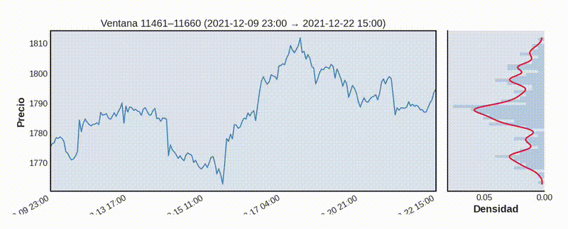

# 📈 Support & Resistance Detection using Market Profile + KDE

This project detects **support and resistance zones** by combining a rolling **market profile** approach with a **Kernel Density Estimator (KDE)** built from scratch in NumPy.

The goal is to highlight price levels where market activity has concentrated over time, signaling potential areas of interest for future price reactions.

---

## 🔍 Overview

### 🧱 Step 1: Rolling Market Profile
For each step in the time series:

- A **sliding window** extracts a segment of recent prices.
- A histogram (`bins_prof` bins) is built to represent how often the price has visited each level within the window.

### 🌊 Step 2: Smoothed KDE
A **custom Gaussian KDE** is applied to each price window to smooth the distribution. This version:

- Is implemented from scratch using only `NumPy`
- Accepts **custom weights**, giving more importance to recent prices (e.g. last candles in the window)
- Adapts the smoothing bandwidth using **Silverman's Rule**, extended for weighted samples

### 📌 Step 3: Detect Levels
- The KDE curve is analyzed for **local maxima**
- These peaks represent potential **support/resistance levels**
- Repeated levels are accumulated over time to identify **strong zones**

---

## 🧮 Math Behind the KDE

📐 Click to show KDE formulas

**1. Gaussian Kernel:**

$$
K(u) = \frac{1}{\sqrt{2\pi}} e^{-\frac{u^2}{2}}
$$

**2. Silverman's Rule (Unweighted):**

$$
h = 1.06 \cdot \sigma \cdot n^{-1/5}
$$

**3. Silverman's Rule (Weighted):**

$$
n_\text{eff} = \frac{(\sum w_i)^2}{\sum w_i^2}, \quad
\mu_w = \frac{\sum w_i x_i}{\sum w_i}, \quad
\sigma_w = \sqrt{\frac{\sum w_i (x_i - \mu_w)^2}{\sum w_i}}, \quad
h = 1.06 \cdot \sigma_w \cdot n_\text{eff}^{-1/5}
$$

**4. Linear Weighting Scheme:**

$$
w_i = w_0 + i \cdot \left( \frac{1 - w_0}{n - 1} \right)
$$

**5. Final KDE Estimate:**

$$\hat{f}h(x) = \frac{1}{\sum w_i \cdot h} \sum{i=1}^{n} w_i \cdot K\left( \frac{x - x_i}{h} \right)$$

---

## 📊 Visualization

Each frame in the animation includes:

- 📉 Current price window  
- 📈 Smoothed KDE profile (side-aligned)  

The output shows **how levels emerge and evolve** as price action unfolds.

---

## 🛠 Tech Stack

| Tool        | Purpose                     |
|-------------|-----------------------------|
| `Python`    | Main language               |
| `NumPy`     | Numerical computation       |
| `Pandas`    | Time series manipulation    |
| `Matplotlib` + `FuncAnimation` | Visualization & animation |
| `ta` _(optional)_ | ATR-based bandwidth adaptation |

---

## 💡 Future Ideas

- 📎 Cluster nearby levels to reduce clutter  
- ⚖️ Add volume as a second weighting mechanism  
- 📈 Combine with RSI/divergence signals for entries  
- 🤖 Integrate into an algorithmic trading bot

---

**Author:**   **yetaTRDR**

